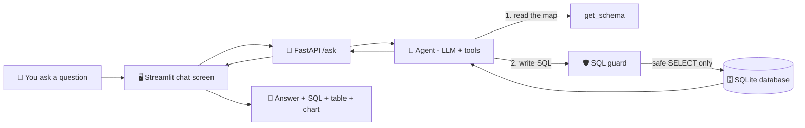

# 💬 Talk to Data

**Ask a database questions in plain English and get answers in plain English.**

Talk to Data is an AI assistant for business data. You type a question such as *"Which five product categories earn the most money?"*. The assistant writes the database query for you, runs it safely, and explains the result in simple language. No SQL knowledge is needed.

> Built with Python, an LLM (Large Language Model), LangChain, FastAPI and Streamlit, on the public Olist Brazilian e-commerce dataset.

---

## Table of Contents

1. [The story in one minute](#1-the-story-in-one-minute)
2. [Small dictionary](#2-small-dictionary)
3. [How it works, step by step](#3-how-it-works-step-by-step)
4. [What is inside the project](#4-what-is-inside-the-project)
5. [How it stays safe](#5-how-it-stays-safe)
6. [Set it up on your computer](#6-set-it-up-on-your-computer)
7. [Run it](#7-run-it)
8. [Check how good it is (evaluation)](#8-check-how-good-it-is-evaluation)
9. [Choosing an AI model](#9-choosing-an-ai-model)
10. [Results](#10-results)
11. [Known limitations](#11-known-limitations)
12. [Troubleshooting](#12-troubleshooting)
13. [Ideas for the future](#13-ideas-for-the-future)

---

## 1. The story in one minute

Imagine a **giant library** with millions of facts written in tables. Only a librarian who speaks a special language (called SQL) can find things in it. Most people do not speak that language, so they wait in line for the librarian.

**Talk to Data is a helpful robot librarian.**

1. You ask a question in everyday words.
2. The robot translates it into the librarian's special language.
3. The robot fetches the facts from the library.
4. The robot tells you the answer in everyday words, and shows you *exactly* what it looked up, so you can trust it.

That is the whole idea.

---

## 2. Small dictionary

| Word | What it means, simply |
|---|---|
| **Database** | A very organized set of tables, like many spreadsheets that are linked together. |
| **SQL** | The special language used to ask a database for information. |
| **Query** | One question written in SQL. |
| **LLM** (Large Language Model) | An AI that reads and writes text. It is the "brain" of the robot. |
| **Agent** | An LLM that can also *use tools*, such as "look at the database" or "run a query". |
| **Tool calling** | The LLM asking the program to run one of its tools and waiting for the result. |
| **API** | A doorway that lets one program talk to another program. |
| **FastAPI** | The tool we use to build that doorway. |
| **Streamlit** | The tool we use to build the chat screen. |
| **Schema** | The list of tables and columns in a database, like a map of the library. |
| **Evaluation** | A quiz for the robot, to measure how often it answers correctly. |

---

## 3. How it works, step by step



Here is what happens when you press Enter:

1. **You type a question** in the chat screen (Streamlit).
2. **The screen sends the question** to the back-end (FastAPI) through a URL called `/ask`.
3. **The agent wakes up.** It is an LLM that has two tools:
   - `get_schema` shows the tables and columns, so the agent knows what exists.
   - `run_sql` runs a database query and returns the rows.
4. **The agent decides what to do.** It may first read the schema, then write a query.
5. **The SQL guard checks the query** before it touches the data. Only safe, read-only queries pass (see [How it stays safe](#5-how-it-stays-safe)).
6. **The database answers.** If the query has a mistake, the error goes back to the agent, which fixes the query and tries again.
7. **The agent writes the answer** in plain language, using the real numbers it received.
8. **The screen shows** the answer, the SQL that was used, a results table and, when it makes sense, a bar chart.

---

## 4. What is inside the project

```
talk-to-data/
├── app/
│   └── streamlit_app.py      # the chat screen
├── src/
│   ├── config.py             # settings (database path, row limit)
│   ├── db.py                 # read-only database connection + schema reader
│   ├── sql_guard.py          # the safety checker for SQL
│   ├── llm.py                # picks which AI model to use
│   ├── agent.py              # the agent: LLM + tools + instructions
│   └── api.py                # FastAPI back-end (/ask, /health)
├── scripts/
│   ├── load_data.py          # loads the CSV files into the database
│   ├── test_gemini.py        # checks that a Gemini key works
│   ├── list_models.py        # lists Gemini models
│   └── list_groq_models.py   # lists Groq models
├── tests/
│   ├── test_sql_guard.py     # unit tests for the safety checker
│   ├── eval_questions.json   # the quiz: questions + correct SQL
│   └── run_eval.py           # gives the quiz to the agent and scores it
├── data/                     # NOT stored in Git
│   ├── raw/                  # the downloaded CSV files
│   └── olist.db              # the database created from them
├── .env                      # your secret keys (NOT stored in Git)
├── .env.example              # template showing which settings exist
├── requirements.txt          # list of libraries to install
└── README.md
```

---

## 5. How it stays safe

An AI that writes database queries needs guard rails. This project uses several layers, so no single mistake can cause damage.

| Layer | What it does |
|---|---|
| **Read-only connection** | The database is opened in read-only mode. Even if a bad query slipped through, the database itself would refuse to change anything. |
| **SQL guard** | Every query is parsed with `sqlglot`. It must be exactly **one** `SELECT` statement. `INSERT`, `UPDATE`, `DELETE`, `DROP` and `CREATE` are rejected. |
| **Row limit** | Every query is wrapped so it returns at most 50 rows. |
| **Error feedback** | If a query fails, the error message goes back to the agent so it can correct itself instead of guessing. |
| **Step limit** | The agent may take at most 6 steps per question, so it cannot loop forever. |
| **Secrets stay secret** | API keys live in `.env`, which is listed in `.gitignore` and never uploaded. |
| **Show your work** | The screen always offers a **Show SQL** section, so a human can check every answer. |

---

## 6. Set it up on your computer

These steps are written for **Windows and PowerShell**. On Mac or Linux, use `python3` and `source .venv/bin/activate` instead of the activation line.

### What you need first

- **Python 3.10 or newer** ([python.org](https://www.python.org/downloads/))
- **Git** ([git-scm.com](https://git-scm.com/))
- **VS Code** (or any editor)
- **A free LLM key.** Groq is the default here (see [Choosing an AI model](#9-choosing-an-ai-model)).
- About **300 MB** of free disk space for the data

### Step 1: Get the code

```powershell
git clone <your-repository-url>
cd talk-to-data
```

### Step 2: Create a private Python environment

This keeps this project's libraries separate from everything else on your computer.

```powershell
python -m venv .venv
Set-ExecutionPolicy -Scope Process -ExecutionPolicy Bypass
.venv\Scripts\Activate.ps1
```

Your prompt should now start with `(.venv)`.

### Step 3: Install the libraries

```powershell
pip install -r requirements.txt
```

Make sure `requirements.txt` includes the packages for the provider you use, for example `langchain-groq`, `langchain-google-genai` or `langchain-ollama`.

### Step 4: Add your secret keys

Copy the template and open it:

```powershell
Copy-Item .env.example .env
code .env
```

Fill in your values (no quotes, no spaces around `=`):

```
LLM_PROVIDER=groq
MODEL_NAME=your_model_name_here
GROQ_API_KEY=your_key_here
```

> ⚠️ Never share `.env` or commit it to Git. If a key leaks, delete it in the provider's console and create a new one.

### Step 5: Download the data

1. Open the Olist dataset on Kaggle: <https://www.kaggle.com/datasets/olistbr/brazilian-ecommerce>
2. Click **Download** (a free Kaggle account is needed).
3. Unzip the file and copy all the `.csv` files into `data\raw\`.

Check the license and terms on the Kaggle page before reusing the data. The dataset is **not** included in this repository.

### Step 6: Build the database

```powershell
python scripts\load_data.py
```

You should see one line per table, for example `Loaded orders: 99,441 rows`. This creates `data\olist.db`.

### Step 7: Check that the safety tests pass

```powershell
python -m pytest
```

All tests should pass.

---

## 7. Run it

The app has two parts, so you need **two terminals**. Activate the environment (`.venv\Scripts\Activate.ps1`) in each one.

**Terminal 1: the back-end**

```powershell
uvicorn src.api:app --reload
```

Open <http://127.0.0.1:8000/docs> to try the API directly in your browser. `GET /health` should return `{"status":"ok"}`.

**Terminal 2: the chat screen**

```powershell
streamlit run app\streamlit_app.py
```

Your browser opens <http://localhost:8501>. Type a question and press Enter.

### Questions to try

- Which 5 product categories have the highest total revenue?
- How many orders were delivered?
- What was the total revenue per year?
- Which customer states have the most orders?
- What is the average review score?

### Test the agent without the screen

```powershell
python -m src.agent
```

---

## 8. Check how good it is (evaluation)

A demo that works once proves little. So this project includes a **quiz for the robot**.

- `tests/eval_questions.json` holds questions, each with a *gold SQL* query that is known to be correct.
- `tests/run_eval.py` runs the gold SQL to get the correct answer, asks the agent the same question, and compares the two results. This is called **execution accuracy**.

Run a few questions first, then the whole set:

```powershell
python -m tests.run_eval 5
python -m tests.run_eval
```

The script prints PASS or FAIL for each question, the accuracy, the average time per question, and saves the details to a file such as `tests/results_groq_<model>.json`.

When a question fails, check which of these three things is wrong:

1. **The agent** wrote a bad query. Improve the instructions in `src/agent.py`.
2. **The question** is ambiguous. Reword it so it has one clear answer.
3. **The gold SQL** has a mistake. Fix it in the JSON file.

---

## 9. Choosing an AI model

The model is chosen by two lines in `.env`. No code changes are needed.

| `LLM_PROVIDER` | Cost | Notes |
|---|---|---|
| `groq` | Free tier with rate limits | Fast hosted models. Default choice. |
| `gemini` | Free tier with strict daily limits | Good for occasional comparison runs. |
| `ollama` | Free, runs on your own computer | No limits, but speed depends on your RAM and CPU. |

Model names change often. To see what your key can use:

```powershell
python scripts\list_groq_models.py
python scripts\list_models.py
```

Pick a **chat** model that supports **tool calling**. Skip names containing `tts`, `whisper` or `guard`.

Free tiers have request limits, and one question can use several requests. If you see a `429` error, wait a while or switch to another model.

---

## 10. Results

Fill this table with **your own measured numbers** after running the evaluation.

| Model | Provider | Questions | Accuracy | Avg. time per question |
|---|---|---|---|---|
| _your model_ | Groq | _n_ | _x %_ | _x s_ |
| _your model_ | Gemini | _n_ | _x %_ | _x s_ |
| _your model_ | Ollama | _n_ | _x %_ | _x s_ |

**What I learned:** _write two or three sentences about which questions failed and what you changed to improve them._

---

## 11. Known limitations

Being honest about limits is part of good engineering.

- **No memory between questions.** Each question is treated on its own, so a follow-up such as "now split that by region" will not work yet.
- **Shared query log.** The agent stores the queries of the current question in one shared list. Two users asking at the same moment could mix up their results. This is fine for a demo, but not for many users at once.
- **Free-tier rate limits.** Free LLM plans limit how many requests you can make, which affects long evaluation runs.
- **Small evaluation set.** Accuracy on a few dozen questions is a useful signal, not a guarantee.
- **Simple charts.** The chart appears only for two-column results with a number in the second column.
- **One dataset.** The prompts contain hints written for the Olist tables (for example how revenue and categories are defined). A different database needs new hints.
- **Read-only by design.** The assistant can answer questions but can never change the data.

---

## 12. Troubleshooting

| Problem | What to do |
|---|---|
| `running scripts is disabled` when activating the environment | Run `Set-ExecutionPolicy -Scope Process -ExecutionPolicy Bypass`, then activate again. |
| `ModuleNotFoundError: src` | Run commands from the project root (`talk-to-data`) and use `python -m ...` where shown. |
| `.env` values are ignored | Check the file is in the project root, has no quotes or extra spaces, and restart the server after editing it. |
| `404 model not found` | The model name is wrong or retired. List the current names with the `list_*models.py` scripts and update `MODEL_NAME`. |
| `429 RESOURCE_EXHAUSTED` or rate limit | You reached the free limit. Wait, or switch to another model or provider. |
| `tool_use_failed` or a broken tool call | Small models sometimes write a malformed tool call. Try again or use a larger model. |
| `{"detail":"Not Found"}` in the browser | You opened `/` or a wrong path. Use <http://127.0.0.1:8000/docs>. |
| Streamlit says "Can't reach the API" | Terminal 1 (`uvicorn`) is not running, or it uses a different port. |
| `dubious ownership` from Git | Run `git config --global --add safe.directory <your-project-path>`. |
| `Address already in use` | Start the server on another port: `uvicorn src.api:app --reload --port 8001`. |

---

## 13. Ideas for the future

- Conversation memory for follow-up questions
- A business glossary (for example, exact definitions of "revenue" or "active customer")
- The agent asking a clarifying question when a request is unclear
- Better charts, chosen automatically from the result shape
- A larger evaluation set, including questions the data cannot answer
- Docker packaging and a public demo
- Support for PostgreSQL and other databases

---

## Acknowledgements

- Data: [Brazilian E-Commerce Public Dataset by Olist](https://www.kaggle.com/datasets/olistbr/brazilian-ecommerce) on Kaggle
- Built with [LangChain](https://www.langchain.com/), [FastAPI](https://fastapi.tiangolo.com/), [Streamlit](https://streamlit.io/), [sqlglot](https://github.com/tobymao/sqlglot) and [pandas](https://pandas.pydata.org/)

## Author

_Deon_saju · www.linkedin.com/in/deonsaju 